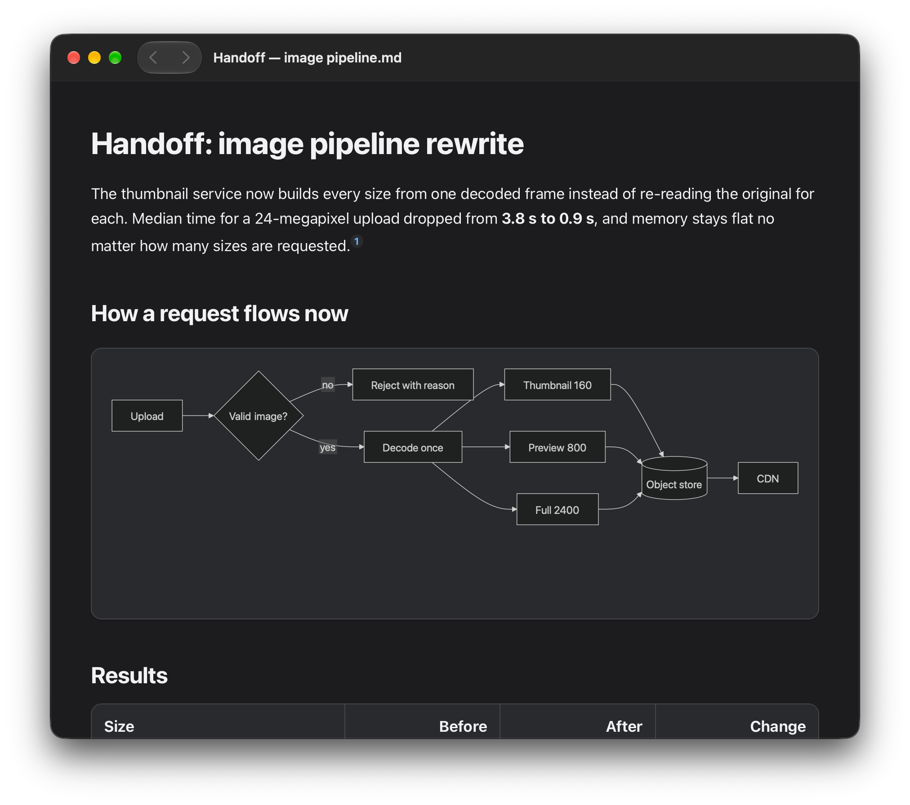

# Tim’s Markdown Reader

A small, free Markdown viewer for Mac.

It's a fast, minimal viewer written in Swift: you open a Markdown file and read it, and there's no editor, no account, no tracking and nothing to configure.

It's handy for the Markdown files that AI tools and coding agents leave behind (reports, notes, handoffs) when you just want to read them without opening an editor.

**Needs an Apple silicon Mac (M1 or newer) running macOS 14 or later.** Intel Macs aren't supported.

https://github.com/user-attachments/assets/799d6293-efe6-4afb-a53b-58ccabe3c16a

## Screenshot



## Download

Get the DMG from the [latest release](https://github.com/temir-dev/tims-markdown-reader/releases/latest). Open it, drag the app to Applications, eject the disk image. Done.

The app is Developer ID-signed and notarized by Apple. The first time you open it, macOS shows its usual "downloaded from the internet" prompt, and that's it.

To make it the default for Markdown files: select a `.md` file in Finder, then **Get Info → Open with → Tim’s Markdown Reader → Change All**.

The app doesn't update itself. **Tim’s Markdown Reader → Check for Updates…** shows your version and opens the download page; to update, download the new version and replace the app. To uninstall, drag it to the Trash. Your files are never touched.

## What it does

- Renders Markdown: headings, tables, code blocks, task lists, footnotes, and images stored next to the file
- Mermaid diagrams, rendered offline
- Find (`⌘F`) highlights every match and shows a count. `⌘G` and `⇧⌘G` jump to the next and previous match
- Links to other Markdown files open in the same window. Go back and forward with the toolbar arrows, the **Go** menu, or `⌘[` and `⌘]`
- Reloads by itself when the file changes on disk
- Light and dark mode follow your Mac
- Settings (`⌘,`) for font, text size and page width
- Opens `.md`, `.markdown` and `.mdx` (MDX is shown as text, not run)

Want to see it in action? Open the [sample files](fixtures/visual-review/00-start-here.md) with it.

## Privacy and safety

Everything happens on your Mac. The app doesn't need the internet and doesn't send anything anywhere. Remote images are blocked, and any HTML inside a document is shown as plain text instead of being run. Links open in your browser only when you click them. More in [PRIVACY.md](PRIVACY.md).

It's a reader, not a security tool, so don't rely on it to make untrusted files safe. If you find a security problem, see [SECURITY.md](SECURITY.md).

## Build it yourself

You need an Apple silicon Mac with Xcode. Open `MarkdownReader.xcworkspace`, pick **Tim's Markdown Reader → My Mac** and run. Or from Terminal:

```sh
scripts/test.sh                    # run all the tests
scripts/build-release.sh --local   # build a DMG for your own use
```

There's nothing else to install. A DMG you build yourself isn't notarized, so other Macs will warn about it. [docs/DEVELOPMENT.md](docs/DEVELOPMENT.md) explains how the code is laid out.

Bug reports and small fixes are welcome. For anything bigger, open an issue first. Please use made-up example files in bug reports, not your private documents.

## License

[MIT](LICENSE), © 2026 Tim Tairov. Licenses for the bundled third-party code (Mermaid, Swift Markdown and others) are in [ThirdParty](ThirdParty/README.md) and inside the app under **Licenses…**.
