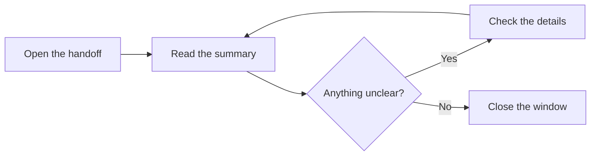
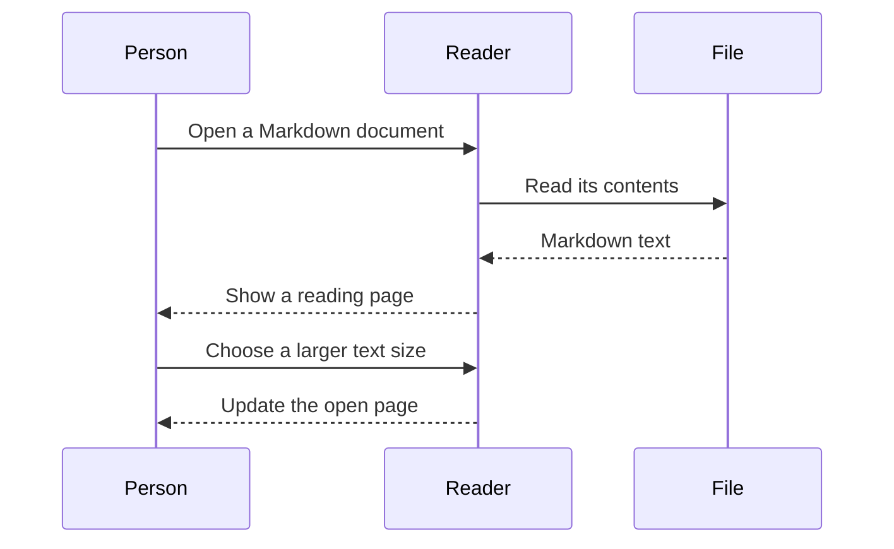
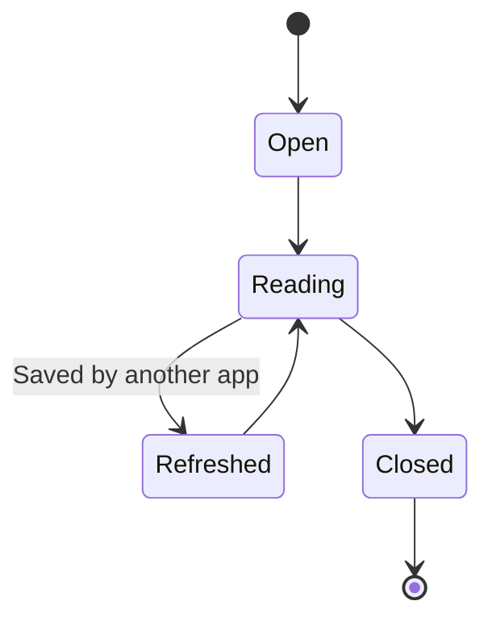

# A plan in diagrams

These examples render locally. Try changing the reading font and text size while this page is open. Give the diagrams a moment to redraw after moving the slider.

## From a note to a decision



## A conversation between components



## A document's day



## An intentionally broken diagram

You should see a short error message here. The rest of the document should remain usable.

```mermaid
this is deliberately not valid diagram syntax
```

## Still here

This paragraph appears after the broken example. [Return to the sample list](00-start-here.md).
